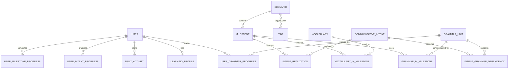
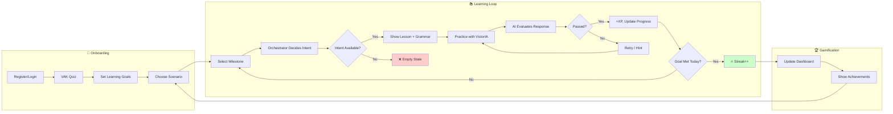
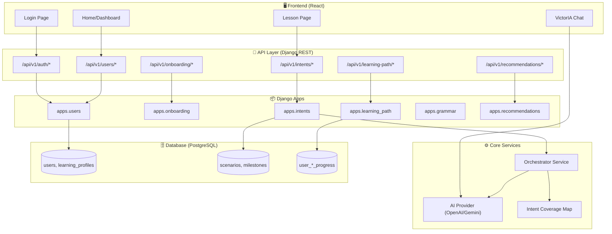
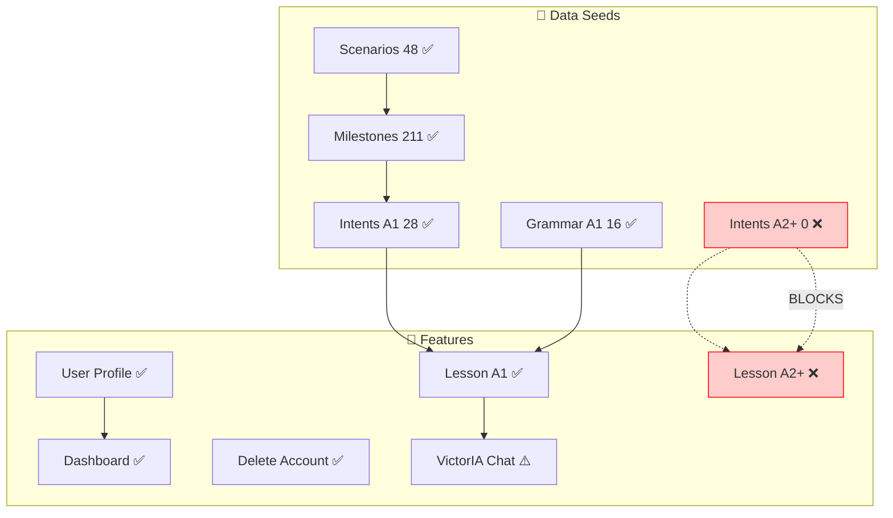

# CHEAT SHEET - Relaciones DB YoPuedo360

## 📋 Tabla Rápida de Conexiones

```
PREGUNTA: ¿Dónde se usa "coffee"?
RESPUESTA: 
  coffee = Vocabulary.objects.get(word='coffee')
  coffee.milestone_usages.all()  ← VocabularyInMilestone
  
PREGUNTA: ¿Qué vocabulario tiene milestone "Order food"?
RESPUESTA:
  milestone = Milestone.objects.get(name='Order food')
  milestone.vocabulary_items.all()  ← VocabularyInMilestone
  
PREGUNTA: ¿En cuántos milestones se usa "can"?
RESPUESTA:
  can = GrammarUnit.objects.get(slug='can-infinitive')
  can.milestone_usages.count()  ← GrammarInMilestone
```

## 🔗 Mapa Mental

```
Scenario (Restaurant)
  └─ Milestone (Order food)
      ├─ Grammar: can+infinitive (order=1) "Can I have...?"
      └─ Vocabulary: coffee (order=3) "Can I have coffee?"

User (Juan)
  ├─ Progress: coffee → mastered
  └─ Progress: can → learning
```

## 🎯 Foreign Keys (FKs)

| Tabla | Campo FK | Apunta a | Reverse name |
|-------|----------|----------|--------------|
| Milestone | `scenario_id` | Scenario | `milestones` |
| VocabularyInMilestone | `vocabulary_id` | Vocabulary | `milestone_usages` |
| VocabularyInMilestone | `milestone_id` | Milestone | `vocabulary_items` |
| GrammarInMilestone | `grammar_id` | GrammarUnit | `milestone_usages` |
| GrammarInMilestone | `milestone_id` | Milestone | `grammar_items` |
| UserVocabularyProgress | `user_id` | User | `vocabularyprogress` |
| UserVocabularyProgress | `vocabulary_id` | Vocabulary | `user_progress` |

## 💡 Tip: Cómo Recordar

**Regla 1:** Si tabla tiene `xxx_id` → FK a tabla `Xxx`
**Regla 2:** Nombre `related_name` → cómo acceder en reversa

Ejemplo:
```python
class VocabularyInMilestone:
    vocabulary = FK(Vocabulary, related_name='milestone_usages')
    #                                        ↑
    # Acceso: coffee.milestone_usages.all()
```

## 🚀 Comandos Django Shell

```python
# Explorar
python manage.py shell

# Ver estructura
Vocabulary._meta.get_fields()

# Ver FKs
[f for f in Vocabulary._meta.get_fields() if f.many_to_one]

# Contar relaciones
coffee.milestone_usages.count()
```

## 🔌 User API Cheat Sheet (Módulo Users)

| Method | Endpoint | Propósito | Respuesta Exitosa |
|--------|----------|-----------|-------------------|
| `GET` | `/api/v1/users/me/` | Obtener perfil (avatar, nivel, metas) | `200 OK` (JSON) |
| `PATCH` | `/api/v1/users/me/` | Actualizar avatar o metas | `200 OK` (JSON) |
| `GET` | `/api/v1/users/me/dashboard/` | Métricas HOME (Racha, XP Hoy, Gráfica 7 días) | `200 OK` (JSON) |
| `DELETE` | `/api/v1/users/me/` | **Hard Delete** (Borrar cuenta y datos) | `204 No Content` |

### 🛠️ Modelos "Users"
*   **User:** Auth, ID, Avatar.
*   **LearningProfile:** Nivel, XP, Racha, Preferencias (VAK).
*   **DailyActivity:** Historial día-a-día (usado por Dashboard).

## 📦 Full DBML Schema (Reference)

```dbml
// Copy this to https://dbdiagram.io/d
// ========================================
// SCENARIOS & MILESTONES (Contenido Base)
// ========================================
Table scenarios {
  id integer [primary key]
  slug varchar(100) [unique, note: 'restaurant, airport, doctor']
  name varchar(200) [note: 'Restaurante, Aeropuerto']
  icon varchar(10)
  description text
  difficulty_min varchar(2) [note: 'A1, A2, B1, etc']
  difficulty_max varchar(2)
  created_at timestamp
  
  indexes {
    slug
    difficulty_min
  }
}
Table milestones {
  id integer [primary key]
  scenario_id integer [ref: > scenarios.id]
  name varchar(200) [note: 'Ordenar comida, Hacer cita']
  level varchar(2) [note: 'A1, A2, B1'] // ⚠️ PROBLEMA ACTUAL
  order integer [note: 'Secuencia dentro del scenario']
  estimated_time integer [note: 'Minutos']
  difficulty integer [note: '1-5']
  created_at timestamp
  
  indexes {
    (scenario_id, level, order)
    level
  }
  
  Note: '''
  🔴 PROBLEMA ACTUAL:
  Milestones tienen level A2, B1...
  Pero solo seeded Intents A1
  → Orquestador no encuentra intents
  '''
}
// ========================================
// GRAMMAR (Universal - No depende de scenario)
// ========================================
Table grammar_units {
  id integer [primary key]
  slug varchar(100) [unique, note: 'can-infinitive, verb-to-be']
  name varchar(200) [note: 'Can + Infinitive']
  form text [note: 'can + base verb']
  pedagogical_sequence integer [note: 'Orden global: 1,2,3...']
  level varchar(2) [note: 'A1, A2, B1']
  created_at timestamp
  
  indexes {
    level
    pedagogical_sequence
  }
  
  Note: 'Grammar universal - existe 1 vez en sistema'
}
Table grammar_in_milestone {
  id integer [primary key]
  grammar_id integer [ref: > grammar_units.id]
  milestone_id integer [ref: > milestones.id]
  context_example json [note: 'Array: ["Can I have coffee?"]']
  importance_weight integer [note: '1-5']
  created_at timestamp
  
  indexes {
    (grammar_id, milestone_id) [unique]
  }
  
  Note: 'Grammar realizada en contexto específico'
}
// ========================================
// INTENTS (Universal - No depende de scenario)
// ========================================
Table communicative_intents {
  id integer [primary key]
  slug varchar(100) [unique, note: 'order-food, ask-price']
  name varchar(200) [note: 'Order food and drinks']
  description text
  category varchar(50) [note: 'needs, social, survival']
  level varchar(2) [note: 'A1, A2, B1'] // ⚠️ SOLO TENEMOS A1
  cefr_rank integer [note: '1-5 prioridad dentro del nivel']
  is_core boolean [default: true]
  created_at timestamp
  
  indexes {
    level
    (level, cefr_rank)
  }
  
  Note: '''
  🔴 ESTADO ACTUAL:
  ✅ 28 intents A1 seeded
  ❌ 0 intents A2+ seeded
  
  → Cuando milestone.level = A2
  → Orquestador busca intents A2
  → Encuentra 0
  → Devuelve empty
  '''
}
Table intent_realization {
  id integer [primary key]
  intent_id integer [ref: > communicative_intents.id]
  milestone_id integer [ref: > milestones.id]
  example_chunks json [note: 'Array: ["Can I have a menu?"]']
  difficulty integer [note: '1-5']
  estimated_time integer [note: 'Minutos']
  priority integer [note: '1-3']
  created_at timestamp
  
  indexes {
    (intent_id, milestone_id) [unique]
  }
  
  Note: '''
  Intent realizado en milestone específico
  Generado on-the-fly por AI
  Caché para futuras consultas
  '''
}
Table intent_grammar_dependency {
  id integer [primary key]
  intent_id integer [ref: > communicative_intents.id]
  grammar_id integer [ref: > grammar_units.id]
  is_critical boolean [default: true]
  order integer [note: 'Orden de presentación']
  
  indexes {
    (intent_id, grammar_id, order)
  }
  
  Note: 'Qué grammar necesita cada intent'
}
// ========================================
// USER PROGRESS
// ========================================
Table user_intent_progress {
  id integer [primary key]
  user_id integer
  intent_id integer [ref: > communicative_intents.id]
  status varchar(20) [note: 'ready, practicing, mastered']
  times_practiced integer [default: 0]
  last_score integer [note: '0-100']
  last_practiced_at timestamp
  created_at timestamp
  
  indexes {
    (user_id, intent_id) [unique]
    (user_id, status)
  }
}
Table user_grammar_progress {
  id integer [primary key]
  user_id integer
  grammar_id integer [ref: > grammar_units.id]
  status varchar(20)
  times_reviewed integer [default: 0]
  last_score integer
  created_at timestamp
  
  indexes {
    (user_id, grammar_id) [unique]
  }
}
// ========================================
// TAGS (Metadata)
// ========================================
Table tags {
  id integer [primary key]
  slug varchar(100) [unique]
  category varchar(50) [note: 'goal, domain, skill']
  
  Note: 'goal:travel, domain:food, skill:speaking'
}
Table scenario_tags {
  scenario_id integer [ref: > scenarios.id]
  tag_id integer [ref: > tags.id]
  
  indexes {
    (scenario_id, tag_id) [pk]
  }
}

// ========================================
// PROBLEMA IDENTIFICADO
// ========================================
Note root_cause {
'''
🔴 PROBLEMA ROOT:
1. Seeds ejecutados:
   ✅ scenarios (48)
   ✅ milestones (211) - TODOS niveles A1-C2
   ✅ grammar A1 (16)
   ✅ intents A1 (28) ← SOLO A1
   
2. Usuario clickea:
   Milestone "Hacer cita" (A2)
   
3. Orquestador filtra:
   intents.filter(level='A2')
   
4. Resultado:
   [] (vacío)
   
5. Devuelve:
   {current_intent: null, target_phrases: []}
'''
}
```

## 🧜‍♀️ Diagrama de Flujo: Error del Orquestador

Este diagrama explica visualmente por qué falla el sistema cuando un usuario elige un nivel avanzado (A2+).

```mermaid
graph TD
    A([User clicks Milestone]) --> B{What Level is Milestone?}
    B -- Level = A1 --> C[Query Intents (Filter A1)]
    B -- Level = A2+ --> D[Query Intents (Filter A2+)]
    
    C --> E{Intents Found?}
    D --> F{Intents Found?}
    
    E -- Yes (28 exist) --> G[🚀 Success: Return Intent + Phrases]
    F -- No (0 exist) --> H[❌ Error: Empty Response]
    
    H -.-> I[Legacy Fallback?]
    I -- No implemented --> J((FAIL))
    
    style H fill:#ffcccc,stroke:#ff0000
    style D fill:#ffeeee,stroke:#ffaaaa
    style G fill:#ccffcc,stroke:#00ff00
```

---

## 🏗️ Arquitectura Completa: YoPuedo360

### 1️⃣ Modelo de Datos (Entity Relationship)



### 2️⃣ Flujo de Aprendizaje del Usuario



### 3️⃣ Arquitectura de Backend (Django Apps)



### 4️⃣ Dependencias Críticas (Qué bloquea qué)




