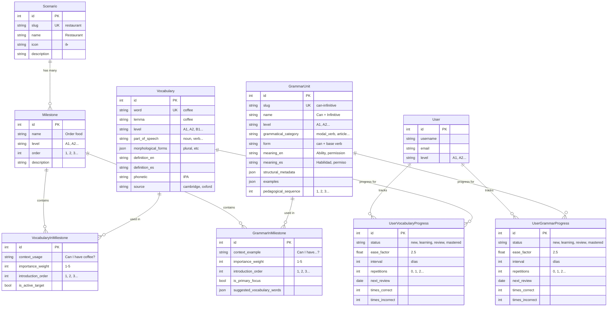

# Database Architecture - YoPuedo360

Diagrama completo de modelos y relaciones.

---

## 📊 Diagrama de Relaciones (ERD)



---

## 🔗 Relaciones Explicadas

### 1. Scenario → Milestone (1 a muchos)

```
Scenario: "Restaurant" 
├─ Milestone 1: "Ask for table"
├─ Milestone 2: "Read menu"
├─ Milestone 3: "Order food"
└─ Milestone 4: "Ask for bill"

FK: Milestone.scenario_id → Scenario.id
```

### 2. Vocabulary → VocabularyInMilestone (1 a muchos)

```
Vocabulary: "coffee"
├─ En Milestone "Order food": context="Can I have coffee?"
├─ En Milestone "Breakfast": context="I drink coffee"
└─ En Milestone "Office": context="Coffee break"

FK: VocabularyInMilestone.vocabulary_id → Vocabulary.id
FK: VocabularyInMilestone.milestone_id → Milestone.id
```

### 3. GrammarUnit → GrammarInMilestone (1 a muchos)

```
GrammarUnit: "can + infinitive"
├─ En Milestone "Restaurant": example="Can I have coffee?"
├─ En Milestone "Airport": example="Can I see passport?"
└─ En Milestone "Hotel": example="Can I check in?"

FK: GrammarInMilestone.grammar_id → GrammarUnit.id
FK: GrammarInMilestone.milestone_id → Milestone.id
```

### 4. User → Progress (1 a muchos)

```
User: "Juan"
├─ VocabularyProgress: coffee → mastered
├─ VocabularyProgress: water → review
├─ GrammarProgress: can → learning
└─ GrammarProgress: will → new

FK: UserVocabularyProgress.user_id → User.id
FK: UserVocabularyProgress.vocabulary_id → Vocabulary.id

FK: UserGrammarProgress.user_id → User.id
FK: UserGrammarProgress.grammar_id → GrammarUnit.id
```

---

## 🎯 Ejemplo Completo de Flujo

### Datos en DB:

```sql
-- CAPA 1: Contenido Universal
Vocabulary #1: word="coffee", level="A1"
GrammarUnit #1: name="can+infinitive", level="A1"

-- CAPA 2: Escenarios
Scenario #1: slug="restaurant", name="Restaurant"
Milestone #1: name="Order food", scenario_id=1

-- CAPA 2: Contextualización
VocabularyInMilestone #1:
  vocabulary_id=1 (coffee)
  milestone_id=1 (Order food)
  context="Can I have a coffee?"
  introduction_order=3

GrammarInMilestone #1:
  grammar_id=1 (can+infinitive)
  milestone_id=1 (Order food)
  context_example="Can I have...?"
  introduction_order=1

-- CAPA 3: Usuario
User #1: username="Juan", level="A1"

-- CAPA 4: Progreso
UserVocabularyProgress #1:
  user_id=1 (Juan)
  vocabulary_id=1 (coffee)
  status="learning"
  next_review=2026-01-18

UserGrammarProgress #1:
  user_id=1 (Juan)
  grammar_id=1 (can+infinitive)
  status="review"
  next_review=2026-01-17
```

### Query para obtener práctica del usuario:

```python
# 1. Usuario entra a Milestone "Order food"
milestone = Milestone.objects.get(name="Order food")

# 2. Obtener grammar de este milestone
grammar_items = milestone.grammar_items.all()
# → [GrammarInMilestone(grammar="can+infinitive", order=1)]

# 3. Obtener vocabulary de este milestone
vocab_items = milestone.vocabulary_items.all()
# → [VocabularyInMilestone(vocabulary="coffee", order=3)]

# 4. Verificar progreso del usuario
user_vocab = UserVocabularyProgress.objects.filter(
    user=juan,
    vocabulary=coffee
).first()
# → status="learning", next_review=2026-01-18

# 5. Decidir qué mostrar
if user_vocab.next_review <= today:
    show_review(coffee)  # Necesita repaso
else:
    show_new_word()  # Mostrar palabra nueva
```

---

## 📐 Convenciones de Nombres

| Campo | Significado | Ejemplo |
|-------|-------------|---------|
| `id` | Primary Key (PK) | Auto-incrementa: 1, 2, 3... |
| `xxx_id` | Foreign Key (FK) a tabla xxx | `scenario_id` → tabla `Scenario` |
| `slug` | Identificador único texto | "restaurant", "can-infinitive" |
| `level` | Nivel CEFR | "A1", "A2", "B1"... |
| `order` | Secuencia | 1, 2, 3... |
| `introduction_order` | Orden EN milestone | 1, 2, 3... |
| `pedagogical_sequence` | Orden GLOBAL | 1, 2, 3... |

---

## 🔍 Cómo Ver Esto en Django Admin

```python
# URL: http://localhost:8000/admin/

# Ver Scenario
Scenario: Restaurant
  ├─ Name: Restaurant
  ├─ Slug: restaurant
  └─ Milestones: [Order food, Ask for bill, ...]

# Click en "Order food"
Milestone: Order food
  ├─ Scenario: Restaurant
  ├─ Level: A1
  ├─ Order: 3
  ├─ Grammar Items:
  │   ├─ can+infinitive (order: 1) "Can I have...?"
  │   └─ a/an (order: 2) "a coffee"
  └─ Vocabulary Items:
      ├─ please (order: 1) "please"
      ├─ water (order: 2) "Can I have water?"
      └─ coffee (order: 3) "Can I have a coffee?"
```

---

## 🛠️ Herramientas que Programadores Usan

### 1. Django Admin (Ya lo tienes)
- Ver todas las relaciones
- Editar datos
- Ver conexiones

### 2. Django Extensions (Genera diagramas automáticos)
```bash
pip install django-extensions pydot
python manage.py graph_models -a -o models.png
```

### 3. DB Diagram Tools
- dbdiagram.io (online)
- Draw.io (diagramas manualmente)
- Mermaid (lo que usé arriba)

### 4. QuerySet Print (Debug)
```python
# Ver SQL generado
milestone.grammar_items.all().query
# → SELECT * FROM grammar_in_milestone WHERE milestone_id=1
```

---

## 💡 Tip: Cómo NO Perderse

### Cuando trabajas en código:

**1. Pregúntate:**
- ¿Qué tabla estoy editando?
- ¿Qué otras tablas se conectan?
- ¿Cuál es la FK?

**2. Usa este patrón:**
```python
# SIEMPRE documenta las relaciones
class VocabularyInMilestone(models.Model):
    """
    Conecta Vocabulary (universal) con Milestone (contexto)
    
    FK:
    - vocabulary → Vocabulary.id
    - milestone → Milestone.id
    """
    vocabulary = models.ForeignKey(Vocabulary)  # ← FK aquí
    milestone = models.ForeignKey(Milestone)    # ← FK aquí
```

**3. Lee el related_name:**
```python
class GrammarInMilestone:
    grammar = models.ForeignKey(
        GrammarUnit,
        related_name='milestone_usages'  # ← Cómo acceder desde GrammarUnit
    )
    
# Uso:
grammar = GrammarUnit.objects.get(slug='can-infinitive')
grammar.milestone_usages.all()  # ← Obtiene todos los GrammarInMilestone
```

---

¿Esto te ayuda a visualizar mejor la estructura? Puedo generar el diagrama como imagen PNG si prefieres 🎯
